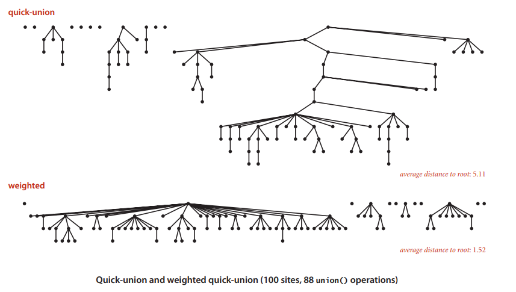

# QuickUnion
An attempt / study of the QuickUnion method

Following the Coursera course for Data Algorithms and decided to put my implementations on here.

Implementations should consist of:

- Dynamic Connectivity
- Quick Find
- Quick Union

and any further improvements or implementations

UPDATE 1:
- first off, I know the workflow on this particular repository is dreadful with commits to main, since its literally 2 algorithms Im not too fussed but im aware its bad practice.

- Second off I am also implementing Weighted Quick Union

Following this structure:

That is all for now :D